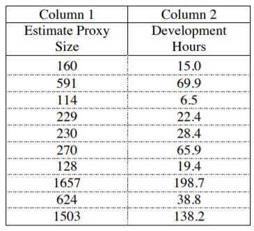
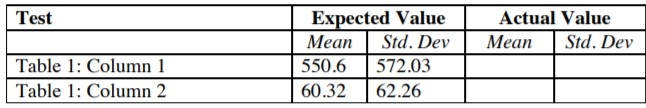
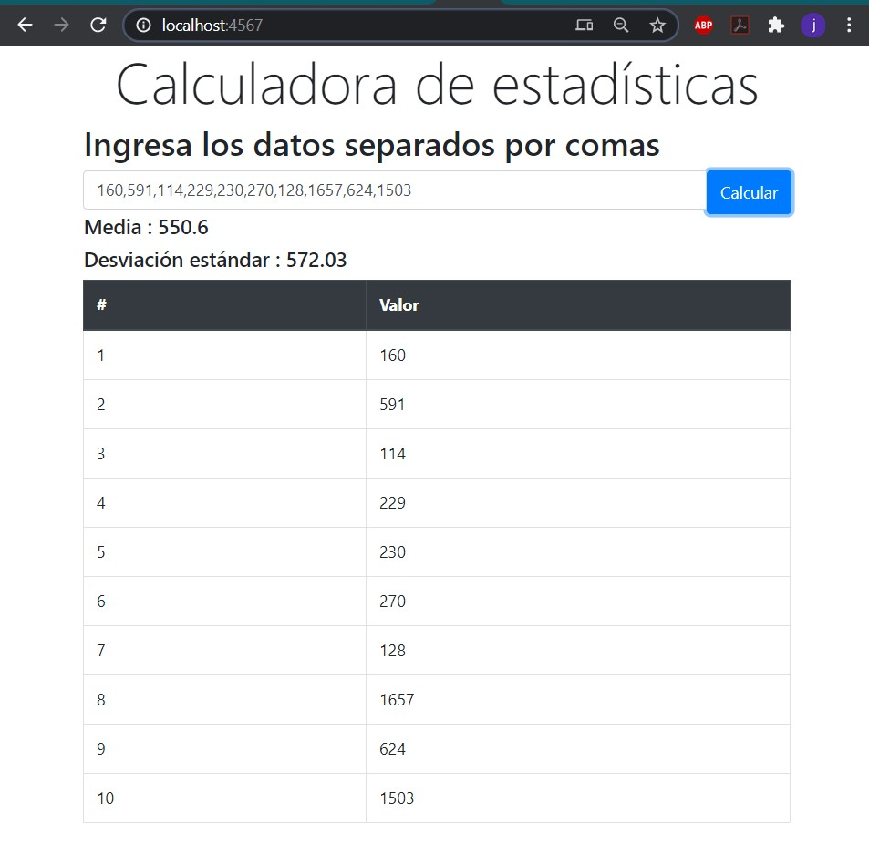
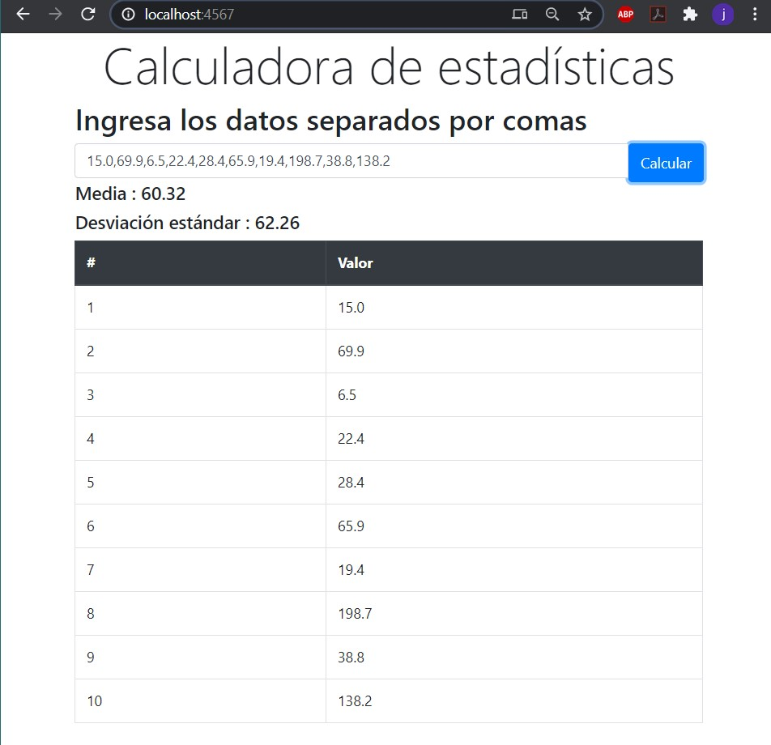

# AREP-Laboratorio 2- Ejercicio Heroku-Spark

El objetivo de este laboratorio crear un programa para calcular la media y 
la desviación estándar de n números reales que se leen de una página web.

Para esto se creó una implementación propia de una LinkedList y un módulo
de estadísticas.Además se utilizó el micro-framework Spark para implementar
 una API-REST que comunica la página web con los servicios de la aplicación.
 Los detalles del diseño se pueden encontrar en el  documento [Informe de diseño.pdf](Informe de diseño.pdf)

En la siguiente tabla se presentan los valores con los que se
probará la implementación



Los valores esperados se presentan a continuación


Finalmente, estos fueron los resultados obtenidos al calcular la media y la
desviación estándar utilizando la aplicación web con los datos propuestos
anteriormente





## Pre-requisitos
* [Maven](https://maven.apache.org/) - Administrador de dependencias
* [Git](https://git-scm.com/) - Sistema de control de versiones 

## Instrucciones de uso

Para descargar el proyecto se debe usar 
```
git clone https://github.com/Jcro15/Lab-SparkWeb.git
```

Una vez descargado el proyecto este debe compilarse con la siguiente instrucción

```
mvn package 
```
Para utilizar la api local, se debe comentar la línea 5 y descomentar la línea 4
del archivo ubicado en /src/main/resources/js/app.js


Para ejecutar la aplicación se debe usar el comando 

```
mvn exec:java -D "exec.mainClass"="edu.escuelaing.arep.SparkWebApp"
```

Para ejecutar las pruebas del proyecto se debe usar el comando
```
mvn test
```
La documentación se puede encontrar en la carpeta Javadoc o puede generarse en 
la ubicación target\site\apidocs\index.html utilizando el comando
```
mvn javadoc:javadoc
```

## Enlace Heroku
  [Despliegue en Heroku](https://whispering-lake-79074.herokuapp.com/)

## Construido con

* [Maven](https://maven.apache.org/) - Administrador de dependencias
* [Junit](https://junit.org/junit5/) - Framework para pruebas en java
* [Spark](http://sparkjava.com/) - Micro-framework para desarrollar aplicaciones web

## Autor

* **Juan Camilo Rojas Ortiz** - *Estudiante de ingeniería de sistemas* 

## Licencia

Este proyecto esta bajo la licencia GNU(General Public License) los detalles se pueden encontrar en el archivo [LICENSE](LICENSE)

